- [Preface](#preface)
  - [Architecture Overview](#architecture-overview)
  - [Technical Breakdown](#technical-breakdown)
    - [Testing](#testing)
  - [Closing Thoughts](#closing-thoughts)
    - [Security Concerns](#security-concerns)
    - [Known Issues](#known-issues)
    - [Conclusion](#conclusion)
    - [References](#references)
  - [Screenshots](#screenshots)
  - [Commands](#commands)
    - [Run](#run)
    - [Tests](#tests)

# Preface

Create a SPA with a couple of pages; one publicly available, and the other login protected using Auth0 (Google account) .
The application also features data fetched over GraphQL utilizing JWT tokens.

## Architecture Overview

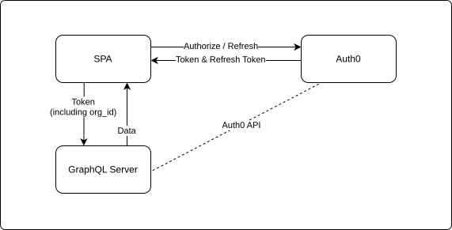

When a protected page is accessed or login is triggered manually, the user is navigated to the Auth0 authentication page

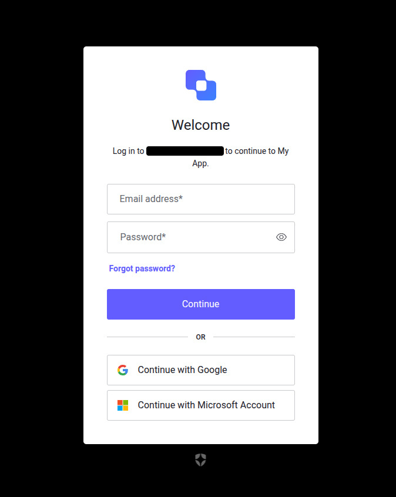

If the user is linked to more than one organization, the user is prompted to choose an organization
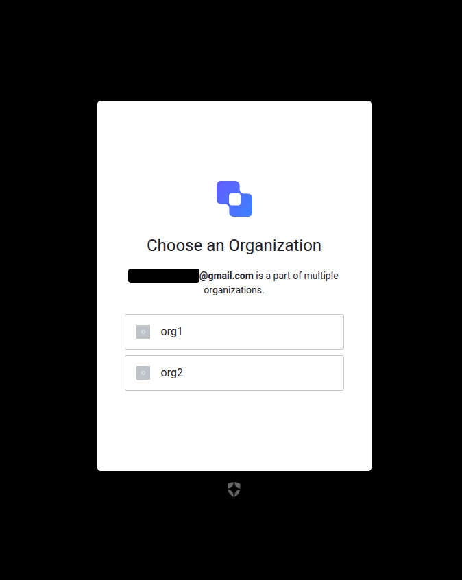

After that, the user is redirected to the SPA (maintaining the initiating page). An access token and a refresh token are stored on the SPA.

Subsequent navigation to protected routes or calling a GraphQL query fetches the stored access token, if the access token has expired, a new access token is requested from Auth0 using the stored refresh token. The newly received access token and refresh token are stored and the original action is completed using the newly received access token.

If both the access token and refresh token have expired, the login flow is restarted while maintaining the previously selected org as it can still be accessed through the expired access token claims.

If a GraphQL query returns an error, the user is shown an alert denoting that the request had failed.
The user can retry the failed query using the retry alert action

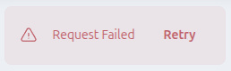

The user can logout by clicking on the user menu which also shows the user email fetched from the token claims.

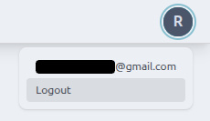

It's assumed that the GraphQL service can extract the `org_id` from the communicated token. If that is not available, the organization ID can easily be fetched from the stored access token user claims and added as a variable to the GraphQL queries.

Different data is fetched from the GraphQL API (effectively mocked in this case) based on the organization chosen through the login flow.

## Technical Breakdown

Auth0 has an [official SDK for React SPAs](https://github.com/auth0/auth0-react) which they recommend as it handles most of the authentication flows and token storage.

Due to constant updates to browser security and privacy measures, depending on cross site IFrames or cookie storage is unreliable.
ITP (Intelligent Tracking Protection) features are constantly rolled out to different browsers and it makes it harder to store tokens for future use.

The default method employed by the Auth0 React SDK depends on web workers/in memory storage alongside cookie storage/IFrames in some scenarios, however, this means that on every refresh a new token needs to be fetched from Auth0.

That issue extends to using refresh tokens as well; as the persistence problem applies to both access token and refresh token.

Storing tokens in memory means they won't be usable across page refreshes or different tabs.

To remedy this issue, `Auth0Provider` accepts a `cacheLocation` prop that accepts `localStorage` option to utilize the browser's local storage for the authorization response.

> Security implications of using local storage will be revisited in a later section.

In order to use refresh tokens, refresh token rotation needs to be activated on the Auth0 application linked to the SPA and `useRefreshTokens` is passed to `Auth0Provider`.

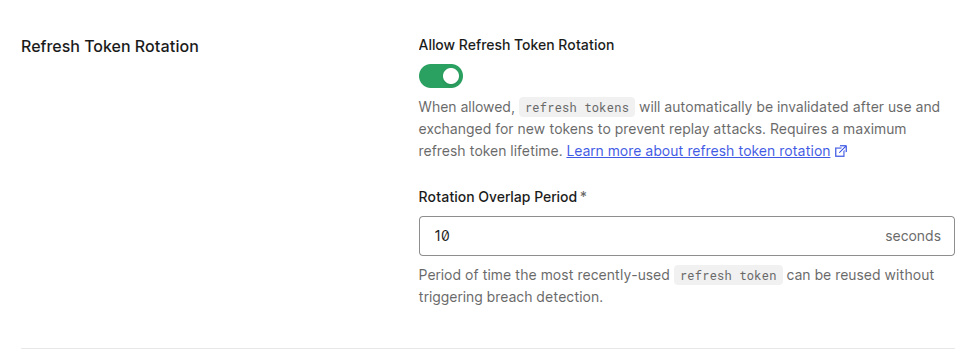

> Auth0 invalidates all access tokens and refresh tokens derived from a given token after a request with an expired token to ensure no malicious activity was involved.

The Auth0 SDK also provides a utility HOC (higher order component) `withAuthenticationRequired` which performs a token check in the background and redirects to the login flow if the refresh token is expired, or refresh the access token if it is still valid.

To secure GraphQL requests `authLink` is set on the Apollo GraphQL client; it effectively taps into the Auth0 context (on each request) via `useAuth0` and `getAccessTokenSilently` which either returns the access token, refreshes the access token if it's expired or redirect to the login flow if both access and refresh tokens are expired.

To access token claims including user info and organization id `useAuth0` taps to `Auth0Provider` context exposing those values to any child element.

Another utility hook is used `useExpiredRefreshTokenCheck`to check the validity of stored tokens on page load and on navigation to another page.

### Testing

MSW JS is used to mock all GraphQL requests when running in dev mode and with **vitest** tests as well.

Vitest mocks and spies are used to black box all interactions with Auth0 Provider and utilities.

Coverage for non-boilerplate code covers most function parts of the code with focus on unit testing and black boxing (rather than integration tests).

TanStack Router doesn't provide an official way for testing or mocking, further research would be needed to cover such cases.

Everything was tested manually as well; especially edge cases with access token and refresh token expiry permutations.

## Closing Thoughts

### Security Concerns

While using local storage offers convenience of use, it exposes the application to XSS (Cross Site Scripting) attacks. Adding refresh tokens and token rotation reduces the attack vectors, but it still contains hashed PII data like email and user info that can be leached by malicious actors. Also, local storage doesn't have an expiry setting and doesn't auto clean if the user closes the tab or browser without logging out first.

Using cookie storage is far more transparent and effective to use, however, it requires the auth integration to be hosted on the same domain as the application itself. Using the same domain name mitigates ITP hurdles and would be utilized by the GraphQL client seamlessly by using `credentials`; which allows attaching same domain cookies to the API request, rather than setting an authorization header with the access token.

> It's important to note that cookies with http only flag are not accessible through JS.

### Known Issues

- When the user is redirected after a successful login, the user is taken to the home page first and then navigated to the redirect url that was attached to the login flow, however, triggering the browser back action takes the user back to the login page that preceded. Further investigation on a production environment can help understand this issue better.
- There're some flash of content scenarios as some operations like token fetching or API query is being processed, adding a content component showing a loader with time threshold could be used for a better user experience.

### Conclusion

Adding Auth0 integration to the existing [codebase](https://github.com/samhwang/vite-starter-template) was executed with the help of the [official Auth0 SDK for React SPAs](https://github.com/auth0/auth0-react), Apollo GraphQL Client for API interactions, TanStack for routing, MSW JS for mocking requests and Vitest for unit testing. Tailwind CSS was used for light weight styling.

Planning involved researching Auth0's integration with React, and also Azure DAB service for GraphQL API. A test account was created on Auth0 with Application, API, Organizations and User definitions, and configurations like application URLs, token expiration and refresh token rotation to name a few.

> To be able to login using your Google account, a user needs to be added to the created application with the corresponding organizations.

### References

- [https://auth0.com/docs/secure/tokens/refresh-tokens/refresh-token-rotation](https://auth0.com/docs/secure/tokens/refresh-tokens/refresh-token-rotation)
- [https://auth0.com/docs/secure/tokens/token-best-practices](https://auth0.com/docs/secure/tokens/token-best-practices)
- [https://auth0.com/docs/secure/security-guidance/data-security/token-storage](https://auth0.com/docs/secure/security-guidance/data-security/token-storage)
- [https://github.com/auth0/auth0-react](https://github.com/auth0/auth0-react)
- [https://owasp.org/www-community/HttpOnly](https://owasp.org/www-community/HttpOnly)

## Screenshots

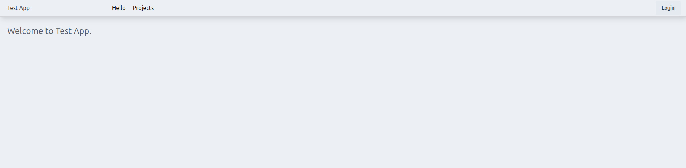

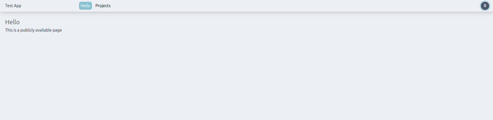

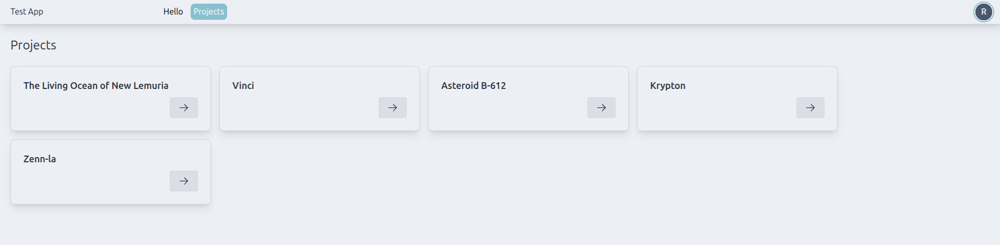

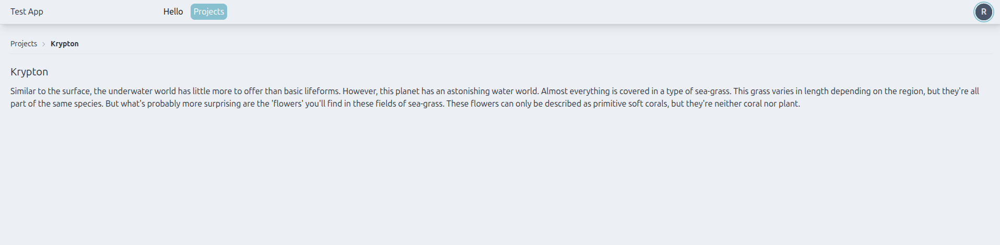

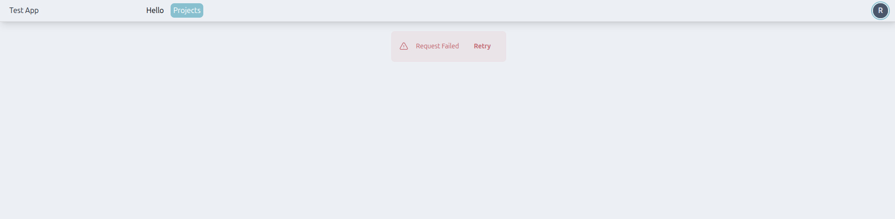

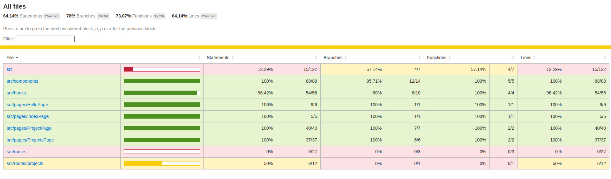

## Commands

### Run

`pnpm i`

`pnpm dev`

Open [http://localhost:5173](http://localhost:5173)

### Tests

`pnpm test`
